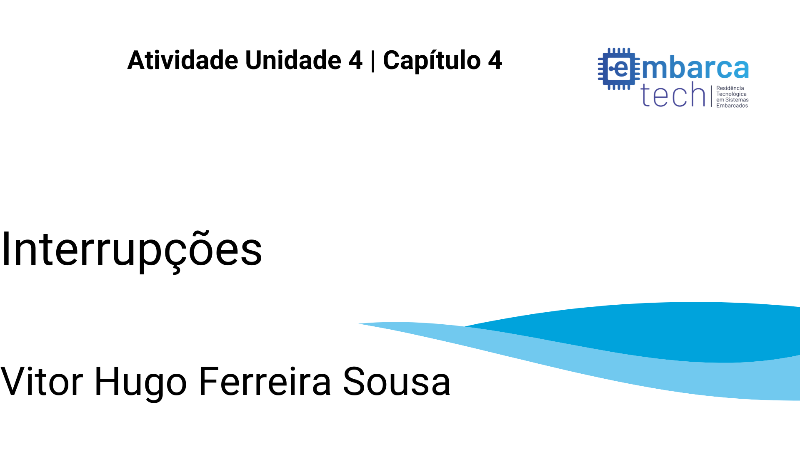

# Tarefa Interrupções - Embarca Tech - U4 C4

### Objetivo e instruções
O código deve executar um padrão onde o led vermelho correspondente a entrada GPIO 13 da BitDogLab deve piscar continuamente 5 vezes por segundo, enquanto ao apertar o botão A irão aparecer números de 0 a 9 representados na matriz de leds de forma crescente a cada vez que o botão A for pressionado, e caso o botão B seja pressionado esse número será decrescente.

 **Link do Vídeo com as intruções sobre o funcionamento do programa:** [Youtube](https://youtu.be/1VXceCQ6OXY)

